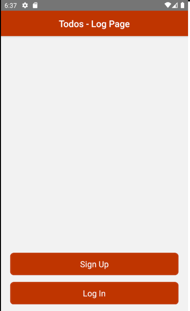
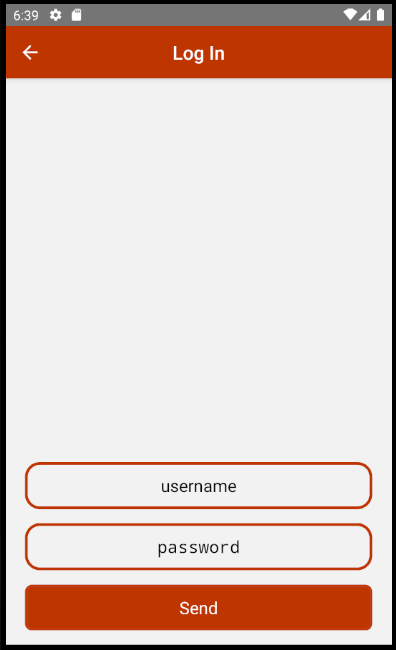
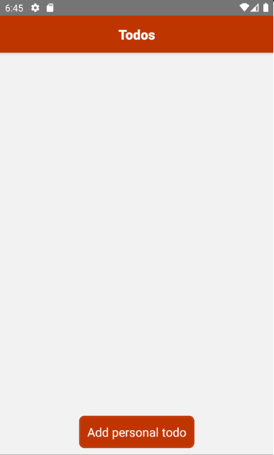
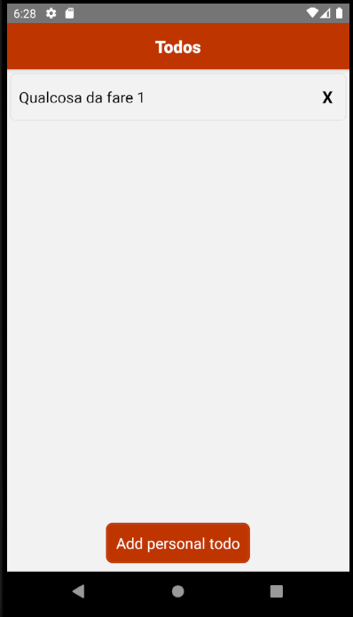

<h1 align="center">Todos</h1>

- [Tecnologie utilizzate](#tecnologie-utilizzate)
- [Backend & API](#backend--api)
- [Keys, CA, Self-signed certificate](#keys-ca-self-signed-certificate)
  - [checkAuth](#checkauth)
- [frontend](#frontend)

## Tecnologie utilizzate

Frontend:
- React Native
  - @react-navigation
    - @react-navigation/native
    - @react-navigation/stack
    - e tutti i pacchetti per supportare la navigazione
  - @react-native-community/netinfo
  - @react-native-async-storage/async-storage
  - fetch, per tutte le richieste
  
Backend:
- NodeJS
  - express
  - body-parser
  - jsonwebtoken
  - bcrypt
  - mongodb
  - mongoose
  - morgan
  - nodemon
- MongoDB
- OpenSSL

## Backend & API

Ogni volta che l'emulatore si avvia resetta i CA, ho optato per ora di usare l'HTTP, ma settando dei CA persistenti sull'emulatore, oppure usando un vero device, è possibile utilizzare il server con protocollo HTTPS.

Il server dispone di queste API:
<br>
<br>
<br>
<br>
<br>
- https://localhost
  - /user
    - post('/signup', ... ), registrazione
    - post('/login', ... ), login
  - /delete
    - delete('/:id', ... ), funziona solo se l'utente è loggato e serve a cancellare l'account
  - /todos
    - get('/', ... ), ottiene la lista delle cose da fare
    - post('/', ... ), aggiunge una cosa da fare
    - delete('/:id', ... ), cancella una cosa da fare
  - /groups
    - per ora non è implementata come funzione ma l'idea è quella di avere dei gruppi che condividono cose da fare

Utilizza un pacchetto chiamato ```morgan``` per loggare a terminale ogni richiesta. Usa l'HTTP e non l'HTTPS.

## Keys, CA, Self-signed certificate

```bash
# generate key pair
openssl genrsa -out key.pem
# generate CSR
openssl req -new -key key.pem -out csr.pem -subj "/C=IT/ST=Italy/L=The Brands/O=Mosciolo Task Force/OU=SFC/CN=jakkins.who/emailAddress=totallytrustablecertificate"
# sign the CSR with the private key
openssl x509 -req -days 60 -in csr.pem -signkey key.pem -out cert.pem
# remove the CSR
rm csr.pem
# extract public key
openssl rsa -in key.pem -pubout -outform PEM -out pub.pem
```

### checkAuth

Per utilizzare tutte le funzioni del server l'utente dovrà essere loggato, ovvero dovrà essere in possesso di un JWT che sarà inviato in ogni richiesta che lo necessita. Anche l'username dovrà essere inviato per confermare il login.

Per ottenere il JWT sarà necessario registrarsi, ogni JWT è unico in quanto non possono esistere 2 utenti con lo stesso username. Al momento della registrazione alle password viene applicata una funzione di hashing tramite il pacchetto ```bcrypt``` che verrà utilizzato anche al momento del login per comparare la password inviata con quella salvata: 
```Javascript
bcrypt.compare(req.body.password, user.password)
.then(result => { ... } )
```
Al momento del login parte del JWT viene criptato con la chiave privata ed inviato.

checkAuth è una middleware che verifica il JWT inviato tramite il pacchetto ```jsonwebtoken```:
```Javascript
const decode = jwt.verify(req.headers.token, pub, {algorithm: 'RS256'})
```
jwt.verify() decripta il JWT usando la chiave pubblica del server e verifica che il payload non sia stato modificato applicandogli una funzione di hash e confrontando questo hash con l'hash decriptato.
Username e JWT sono inviati tramite l'header per permettere l'autenticazione anche per le GET request. In caso di errore all'utente verrà inviato il seguente messaggio: 'invalid or expired token'.

Se qualcuno ottiene il JWT andando a catturare i pacchetti, ad esempio può succedere perché si sta utilizzando il protocollo HTTP, che si inviano client e server, questa persona potrà leggere tutti i dati del client.

Se l'autenticazione avviene con successo verranno aggiunti ai dati della richiesta i dati del JWT che contengono i dati dell'utente.

<br>

## frontend

Su ./android/app/src/debug/AndroidManifest.xml l'opzione ```android:usesCleartextTraffic="true"``` permette lo scambio dati con l'HTTP che da Android 9.0 se non sbaglio è stato rimosso.

Tutto il codice del frontend risiede all'interno della cartella ```__app```.

<div class="brands">
  <ul style="">
    <li style="display: inline-block; list-style: none;"></li>
    <li style="display: inline-block; list-style: none;"></li>
    <li style="display: inline-block; list-style: none;"></li>
  </ul>
  <ul>
    <li style="display: inline-block; list-style: none;"></li>
    <li style="display: inline-block; list-style: none;"></li>
    <li style="display: inline-block; list-style: none;"></li>
  </ul>
</div>
