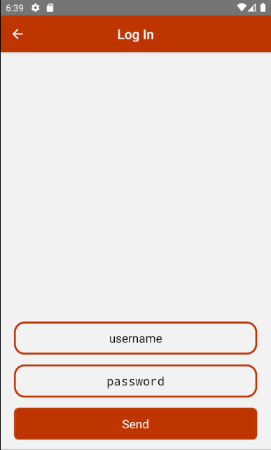
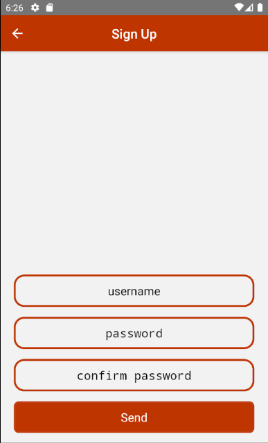

<h1 align="center">Todos</h1>

- [Mission](#mission)
- [L'idea dietro l'app](#lidea-dietro-lapp)
- [Stato attuale dell'app](#stato-attuale-dellapp)

## Mission

Probabilmente esistono tantissime app per la gestione della lista delle cose da fare quindi ho usato questo esame più che altro per imparare qualcosa sulla sicurezza ed abilitare l'invio tramite HTTPS tra Android e server grazie a certificati riconosciuti.

Gli obiettivi di questa app sono 2:
- la gestione di una lista di cose da fare condivisa tra un gruppo di utenti e modificabile solo dagli utenti facente parte di quel gruppo
- invio, ricezione e salvataggio di qualsiasi dato difeso da un meccanismo di protezione: HTTPS, hash e altro.

## L'idea dietro l'app

Più e più volte mi è successo di avere un gruppo, che sia di amici, o di lavoro, o semplicemente la famiglia, che non aveva un modo stabile per organizzarsi e le chat non aiutano (visto che non tutti usano telegram).
Così ho sentito la necessità di creare un'app e con questo esame ho avuto la seconda motivazione per cominciare a svilupparla.

L'idea è quella di avere:
- una facile registrazione
- una navigazione facilmente intuibile
- la possibilità di essere anonimi

La caratteristica principale però sarebbe quella di avere la possibilità di essere invitati (tramite username che è univoco) in dei gruppi che condividano la stessa lista delle cose da fare.

Esempio:
- esiste un utente di nome Giacomo
- viene invitato nel gruppo della sua famiglia
- appena entrato può leggere la lista delle cose da fare aggiornata dagli altri utenti ma può anche modificarla
- nessuno all'infuori di quel gruppo può vedere quella lista
- Giacomo può comunque partecipare ad altri gruppi e partecipa di base ad un gruppo speciale dove esiste solo lui e dove ha la sua lista di cose da fare

 
 
 

## Stato attuale dell'app

In questo momento l'app supporta 2 funzioni:
- la funzione di registrazione di un utente
- l'aggiunta e l'eliminazione da parte di un utente loggato di una cosa da fare

Sicurezza attuale:
- HTTPS per tutte le richieste
- hash della password
- autenticazione tramite JWT

Cosa manca:
- API per le autorizzazioni
- API per la gestione dei gruppi
- criptazione dei promemoria aggiunti dagli utenti

So che mancano le funzioni principali... A mia discolpa ho perso tempo nel cercare di capire come utilizzare Java su React Native (utilizzo un modulo nativo che esegue un ping al server per vedere se è online e con React Native questa cosa non si può fare, quindi ho dovuto usare Java) e nel cercare di farmi firmare il certificato da una CA.

Login e registrazione
<ul>
  <li style="display: inline-block; list-style: none;"></li>
  <li style="display: inline-block; list-style: none;"></li>
  <li style="display: inline-block; list-style: none;"></li>
</ul>

Schermata dopo il login
<ul>
  <li style="display: inline-block; list-style: none;"></li>
  <li style="display: inline-block; list-style: none;"></li>
  <li style="display: inline-block; list-style: none;"></li>
</ul>

